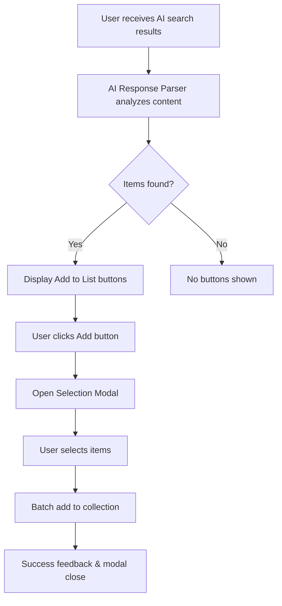
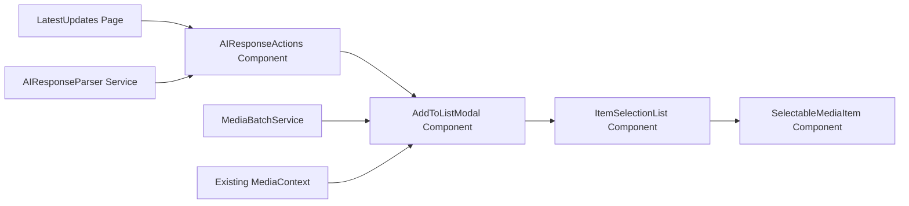

# Design Document

## Overview

The AI-powered watchlist/readlist feature extends the existing OpenAI search functionality by adding intelligent content parsing and batch addition capabilities. The system will analyze AI responses to extract book and movie recommendations, present them in an intuitive selection interface, and seamlessly add selected items to the user's collection with appropriate default statuses.

The design leverages the existing architecture patterns including React Query for state management, the established modal patterns for UI consistency, and the current API structure for data persistence.

## Architecture

### High-Level Flow



### Component Architecture



## Components and Interfaces

### 1. AI Response Parser Service

**Purpose:** Extract book and movie information from AI-generated text responses.

**Interface:**

```typescript
interface ParsedMediaItem {
  type: "book" | "movie";
  title: string;
  author?: string;
  director?: string;
  genre?: string[];
  description?: string;
  confidence: number; // 0-1 score for extraction confidence
}

interface ParsedResponse {
  books: ParsedMediaItem[];
  movies: ParsedMediaItem[];
  hasBooks: boolean;
  hasMovies: boolean;
}

class AIResponseParser {
  static parseResponse(content: string): ParsedResponse;
  private static extractBooks(content: string): ParsedMediaItem[];
  private static extractMovies(content: string): ParsedMediaItem[];
  private static cleanTitle(title: string): string;
  private static extractGenres(text: string): string[];
}
```

**Parsing Strategy:**

- Use regex patterns to identify common book/movie title formats
- Look for author/director indicators ("by", "directed by", "from")
- Extract from structured lists (bullets, numbers) and narrative text
- Apply confidence scoring based on context clues
- Handle various formatting styles (quotes, italics, bold)

### 2. AIResponseActions Component

**Purpose:** Display appropriate action buttons below AI search results.

**Interface:**

```typescript
interface AIResponseActionsProps {
  searchResult: OpenAISearchResponse;
  onItemsAdded?: (type: "books" | "movies", count: number) => void;
}

const AIResponseActions: React.FC<AIResponseActionsProps>;
```

**Behavior:**

- Automatically parse AI response on mount
- Show "Add to ReadList" button if books found
- Show "Add to WatchList" button if movies found
- Handle loading states during parsing
- Display item counts in button labels

### 3. AddToListModal Component

**Purpose:** Present extracted items for user selection and batch addition.

**Interface:**

```typescript
interface AddToListModalProps {
  isOpen: boolean;
  onClose: () => void;
  items: ParsedMediaItem[];
  type: "books" | "movies";
  onItemsAdded: (count: number) => void;
}

const AddToListModal: React.FC<AddToListModalProps>;
```

**Features:**

- Multi-select interface with checkboxes
- Preview of extracted information
- Validation for required fields
- Batch addition with progress feedback
- Duplicate detection and warnings

### 4. SelectableMediaItem Component

**Purpose:** Individual item display with selection capability.

**Interface:**

```typescript
interface SelectableMediaItemProps {
  item: ParsedMediaItem;
  isSelected: boolean;
  onSelectionChange: (selected: boolean) => void;
  isDuplicate?: boolean;
}

const SelectableMediaItem: React.FC<SelectableMediaItemProps>;
```

**Display Elements:**

- Checkbox for selection
- Title (primary text)
- Author/Director (secondary text)
- Genres (badge list)
- Confidence indicator
- Duplicate warning if applicable

### 5. Media Batch Service

**Purpose:** Handle batch operations for adding multiple items.

**Interface:**

```typescript
interface BatchAddRequest {
  books?: CreateBookRequest[];
  movies?: CreateMovieRequest[];
}

interface BatchAddResponse {
  success: boolean;
  added: number;
  failed: number;
  errors?: string[];
  duplicates?: string[];
}

class MediaBatchService {
  static async batchAddItems(
    request: BatchAddRequest
  ): Promise<BatchAddResponse>;
  static async checkDuplicates(
    items: ParsedMediaItem[],
    userId: string
  ): Promise<string[]>;
}
```

## Data Models

### Extended Types

```typescript
// Extend existing types for batch operations
interface CreateBookRequestBatch extends Omit<CreateBookRequest, "userId"> {
  source?: "ai_recommendation";
  confidence?: number;
}

interface CreateMovieRequestBatch extends Omit<CreateMovieRequest, "userId"> {
  source?: "ai_recommendation";
  confidence?: number;
}

// New API endpoints
interface BatchAddBooksRequest {
  books: CreateBookRequestBatch[];
}

interface BatchAddMoviesRequest {
  movies: CreateMovieRequestBatch[];
}
```

### Database Schema Extensions

No changes to existing schemas required. The feature will use existing Book and Movie models with standard fields. Optional metadata can be stored in the review field or as additional fields if needed later.

## Error Handling

### Parsing Errors

- **No items found:** Display informative message, no buttons shown
- **Low confidence extractions:** Include confidence indicators, allow user review
- **Malformed content:** Graceful degradation, partial results if possible

### API Errors

- **Duplicate items:** Show warnings, allow user to choose whether to add
- **Validation failures:** Display field-specific errors in modal
- **Network errors:** Retry mechanism with exponential backoff
- **Partial failures:** Show success count and error details

### User Experience Errors

- **Empty selections:** Disable add button, show helper text
- **Modal state issues:** Proper cleanup on close, prevent multiple submissions
- **Loading states:** Clear indicators during parsing and adding operations

## Testing Strategy

### Unit Tests

**AIResponseParser Service:**

- Test various text formats (lists, paragraphs, mixed content)
- Validate extraction accuracy with known inputs
- Test edge cases (empty content, no matches, malformed text)
- Verify confidence scoring logic

**Components:**

- Test button visibility logic based on parsed content
- Verify modal state management and selection handling
- Test error states and loading indicators
- Validate accessibility features

### Integration Tests

**End-to-End Flows:**

- Complete user journey from AI search to item addition
- Test with various AI response formats
- Verify data persistence and collection updates
- Test error recovery scenarios

**API Integration:**

- Test batch addition endpoints
- Verify duplicate detection logic
- Test validation and error responses
- Performance testing with large batches

### User Acceptance Testing

**Scenarios:**

- Add single book from AI recommendation
- Add multiple movies from mixed content response
- Handle duplicate detection gracefully
- Recover from parsing failures
- Edit AI-added items later

## Implementation Phases

### Phase 1: Core Parsing and UI

- Implement AIResponseParser service
- Create basic AIResponseActions component
- Add simple selection modal
- Basic batch addition functionality

### Phase 2: Enhanced Features

- Improve parsing accuracy and confidence scoring
- Add duplicate detection
- Implement error handling and recovery
- Add loading states and progress indicators

### Phase 3: Polish and Optimization

- Performance optimizations for large responses
- Enhanced UI/UX with animations and feedback
- Comprehensive error messages and help text
- Analytics and usage tracking

## Security Considerations

### Input Validation

- Sanitize all extracted text content
- Validate parsed data against existing schemas
- Prevent injection attacks through malicious AI responses

### Rate Limiting

- Implement reasonable limits on batch operations
- Prevent abuse through automated requests
- Monitor for unusual usage patterns

### Data Privacy

- No sensitive information stored in parsing metadata
- User data remains within existing privacy boundaries
- Optional analytics data anonymized

## Performance Considerations

### Parsing Performance

- Efficient regex patterns for text analysis
- Lazy loading of parsing results
- Caching of parsed responses for repeated access

### UI Performance

- Virtual scrolling for large item lists
- Debounced selection changes
- Optimistic updates for better perceived performance

### API Performance

- Batch operations to reduce request count
- Proper indexing for duplicate detection queries
- Connection pooling for concurrent requests

## Accessibility

### Keyboard Navigation

- Full keyboard support for modal and selection interface
- Proper tab order and focus management
- Escape key handling for modal dismissal

### Screen Reader Support

- Semantic HTML structure with proper ARIA labels
- Descriptive text for selection states
- Progress announcements during batch operations

### Visual Accessibility

- High contrast mode support
- Scalable text and interface elements
- Clear visual indicators for selection states
